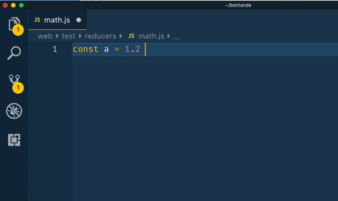

# eslint-plugin-arithmetic



ESLint rule which calculates out some simple arithmetics.  
Useful for when you know what you want to write, but you cannot be bothered to calculate it.

- Supports <kbd>+</kbd>, <kbd>-</kbd>, <kbd>*</kbd>, <kbd>/</kbd>, <kbd>%</kbd>, <kbd>|</kbd>
- Supports `Math.floor()`, `Math.ceil()`, `Math.round()`
- Recommended for use in an editor which autofixes your code when you save the file

## Installation

```sh
# Shell
npm install -D eslint-plugin-arithmetic
```

```js
// eslintrc.js
{
    "plugins": ["arithmetic"],
    "rules": {
        "calc": "warn"
    }
}
```

## But what if I don't want to calculate some stuff?

Sometimes it is useful to have things like `3600 * 1000` in your code to make it easier to understand that you mean 1 hour. Maybe you will find the package [ms](https://npmjs.org/package/ms) useful.

You can also put `// eslint-disable-line arithmetic/calc` at the end of a line to not calculate an expression.

If you find this cumbersome, this package might not be for you.


## Created by
- [Jonny Burger](jonny.io)

## License
MIT
